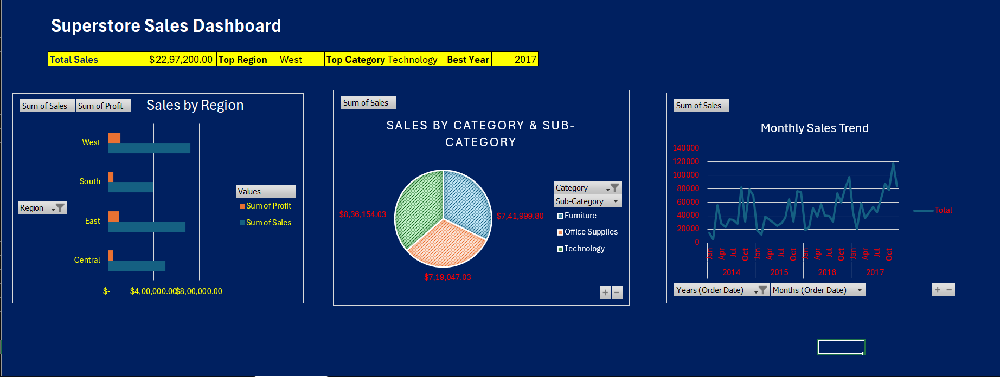

# 🛒 Superstore Sales Dashboard

## 📌 Project Overview
Interactive Sales Dashboard built in Microsoft Excel
analyzing $2.3M+ in sales data from 2014-2017.

## 🛠️ Skills Used
- Data Cleaning
- Pivot Tables
- VLOOKUP & XLOOKUP
- Charts & Visualizations
- Dashboard Design

## 📊 Key Insights
- Top Region: West ($7,25,457)
- Top Category: Technology ($8,36,154)
- Best Year: 2017

## 📸 Dashboard Preview

## 📁 Files
- `Superstore.xlsx` - Main Excel file
- `Superstore_Dashboard.png` - Dashboard preview
